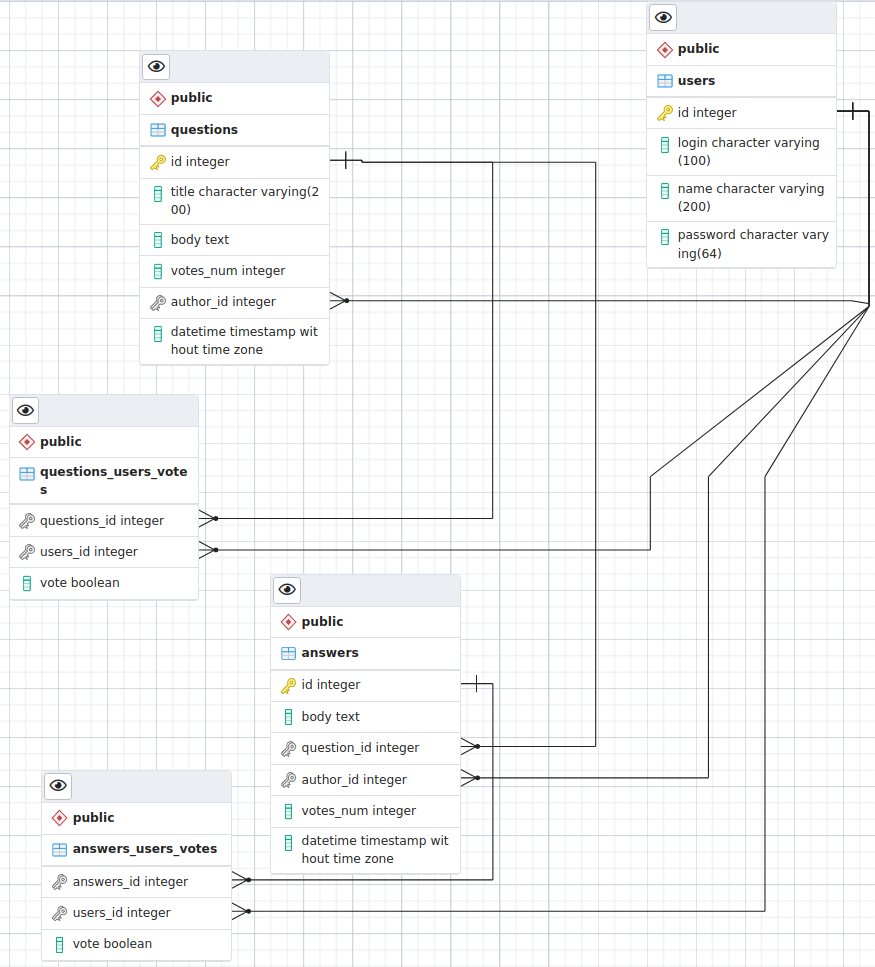

# Objective:
Design a web site where users can post Questions and Answers

## Functional requirements
* Post q & a
* Votes for q & a
* Recent questions view
* Popular questions view(calculated by votes)
* Comments are out of scope
* Search is handled by an external system
* When users visit the web site, they should instantly see answers
* No editing or deletion is supported
* Question has title and the body

## Non-functional requirements
* 10 million users total
* 5 million questions
* 20 million answers 
* 500 million reads in 1 year
* one geographic location


## Database schema

In this simple design we denormalize the votes count.
We have `questions_users_votes` and `answers_users_votes` table where 
each vote is stored, alond with boolean value indicating if it is upvote or downvote.  
These tables are used to check if user has already voted to disallow multiple votes from the same user.  
But also we store the counters for each question and answer directly in the corresponding tables,
so we do not have to run `SUM` every time we render question page.



## Estimations
### DB size:
<!-- http://www.sciweavers.org/free-online-latex-equation-editor -->
Users table:
```
10 million users.
Each user record should take 368 bytes. Let's round up to 1KB for indexes and overhead.
10*10^6 * 1KB = 10^7 KB = 10^4MB ~ 10 GB
```

Questions table:
```
5 million answers.
Let's say on average question body size is 3KB.
Each question will take 3096 + 220 bytes. Let's round up to 10KB for indexes and overhead.
5*10^6 * 10KB = 5*10^7 KB = 5*10^4MB ~ 50 GB
```

Answers table:
Let's assume similar size as for questions. Given 20 million answers,
we will have `200 GB`.

Votes:
Let's assume that on average, 25% of readers will vote. So we should expect to have
`500 mln * 0.25 = 100 million` votes.  
Each vote will take 9 byte. Round up to 20 bytes for overhead.
That will give us `2GB`.

So the total DB size 262GB. Should fit on one server.

### Can one server handle the read load?
```
        6                             6              
500 * 10       6                    10               
--------- ~  10  reads per day  =  ----- RPS ~ 10 RPS
   365                             86400             
```
Can easily be handled by single web server.

## Design
* Seems like all the requirements can easily be handled by a single server running PostgreSQL and some web server.
* We can have a hot standby replica for failover.
